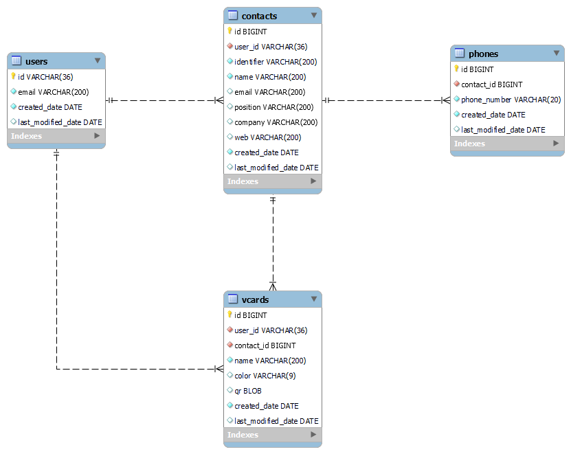

# VCard Backend project

VCard Backend es un proyecto por diversión que realizo en colaboración con mi amiga [La mushasha Cinthia](https://github.com/CinthiaSR) quien realiza un Frontend ([CinthiaSR/Qr_Card](https://github.com/CinthiaSR/Qr_Card)) así bien guapo.

Esta aplicación permite crear tarjetas de negocio o presentación con un QR.

## DB

Se adjunta el archivo sql y diagrama en la carpeta `db`

## REST API

### Dependencies

-   Spring Framework
-   Springboot
-   Spring Web
-   Spring Hateoas
-   Spring JPA
-   Spring Security
-   Spring Resource Server
-   Spring validation
-   Spring Cloud AWS
-   MySQL Driver
-   Lombok
-   Mapstruct
-   Okapi Barcode

### Endpoints

| Método | Endpoint                       | Descripción                                                        |
| ------ | ------------------------------ | ------------------------------------------------------------------ |
| GET    | /{userId}/contacts             | Obtiene todos los contactos creados por el usuario                 |
| GET    | /{userId}/contacts/{contactId} | Obtiene un contacto por su id y el id del usuario                  |
| POST   | /{userId}/contacts             | Crea un contacto para un usuario                                   |
| PUT    | /{userId}/contacts/{contactId} | Acutaliza un contacto por su id y el id del usuario                |
| DELETE | /{userId}/contacts/{contactId} | Elimina un contacto por su id y el id del usuario                  |
| POST   | /users                         | Crea un usuario en la base de datos                                |
| GET    | /{userId}/summary              | Obtiene los totales de contactos y tarjetas creadas por el usuario |
| POST   | /{userId}/vcards               | Crea una vcard para un usuario                                     |
| GET    | /{userId}/vcards               | Obtiene todas las vcards creadas por el usuario                    |
| GET    | /{userId}/vcards/{vcardId}     | Obtiene una vcard por su id y el id del usuario                    |
| PUT    | /{userId}/vcards/{vcardId}     | Actualiza una vcard por su id y el id del usuario                  |
| DELETE | /{userId}/vcards/{vcardId}     | Elimina una vcard por su id y el id del usuario                    |
| GET    | /{userId}/vcards/{vcardId}/qr  | Descarga la imagen png del qr generado para la vcard por su id     |

### Security

| Método | Path                           | Seguridad                                                                 |
| ------ | ------------------------------ | ------------------------------------------------------------------------- |
| GET    | /{userId}/contacts             | Usuario autenticado en cognito, los recursos pertenecen al usuario        |
| GET    | /{userId}/contacts/{contactId} | Usuario autenticado en cognito, el recurso pertenece al usuario           |
| POST   | /{userId}/contacts             | Usuario autenticado en cognito, el recurso creado pertenecerá al usuario  |
| PUT    | /{userId}/contacts/{contactId} | Usuario autenticado en cognito, el recurso pertenece al usuario           |
| DELETE | /{userId}/contacts/{contactId} | Usuario autenticado en cognito, el recurso pertenece al usuario           |
| POST   | /users                         | Aplicación cliente M2M autenticada en cognito, únicamente para AWS Lambda |
| GET    | /{userId}/summary              | Usuario autenticado en cognito, los recursos pertenecen al usuario        |
| POST   | /{userId}/vcards               | Usuario autenticado en cognito, el recurso creado pertenecerá al usuario  |
| GET    | /{userId}/vcards               | Usuario autenticado en cognito, los recursos pertenecen al usuario        |
| GET    | /{userId}/vcards/{vcardId}     | Usuario autenticado en cognito, el recurso pertenece al usuario           |
| PUT    | /{userId}/vcards/{vcardId}     | Usuario autenticado en cognito, el recurso pertenece al usuario           |
| DELETE | /{userId}/vcards/{vcardId}     | Usuario autenticado en cognito, el recurso pertenece al usuario           |
| GET    | /{userId}/vcards/{vcardId}/qr  | Usuario autenticado en cognito, el recurso pertenece al usuario           |

### Variables/Propiedades

#### Ambiente DEV (LOCAL)

| Variable de entorno | Descripción                                                                    |
| ------------------- | ------------------------------------------------------------------------------ |
| DB_URL              | Cadena de conexión de base de datos en MySQL                                   |
| DB_USERNAME         | Usuario de la base de datos para el consumo desde la aplicación                |
| DB_PASSWORD         | Contraseña del usuario de la base de datos para el consumo desde la aplicación |
| ISSUER_URI          | Issuer de user pool de cognito                                                 |

#### Ambiente PROD

Para producción se utilizan la Parameters Store de AWS con el path base /config/backend-vcard/

| Propiedades                                          | Descripción                                                                    |
| ---------------------------------------------------- | ------------------------------------------------------------------------------ |
| spring.datasource.url                                | Cadena de conexión de base de datos en MySQL                                   |
| spring.datasource.username                           | Usuario de la base de datos para el consumo desde la aplicación                |
| spring.datasource.password                           | Contraseña del usuario de la base de datos para el consumo desde la aplicación |
| spring.security.oauth2.resourceserver.jwt.issuer-uri | Issuer de user pool de cognito                                                 |

## CI/CD con AWS Pipelines

Este proyecto está configurado para compilarse y desplegarse automáticamente usando:

-   **AWS CodePipeline** como orquestador
-   **AWS CodeBuild** para compilar el proyecto con Maven
-   **Elastic Beanstalk** para desplegar la aplicación

# References

Frontend [CinthiaSR/Qr_Card](https://github.com/CinthiaSR/Qr_Card)
